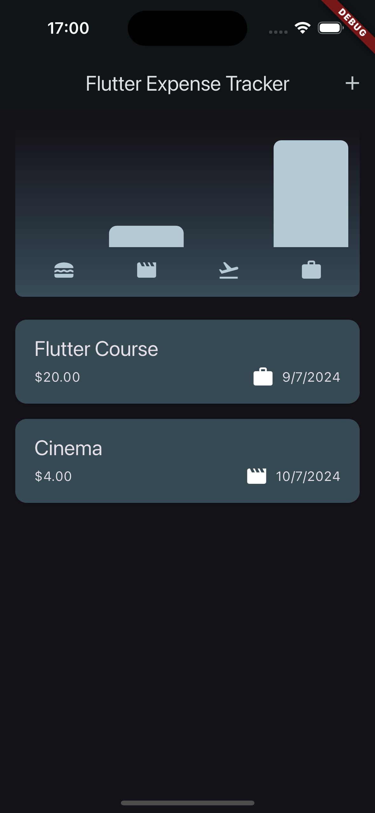
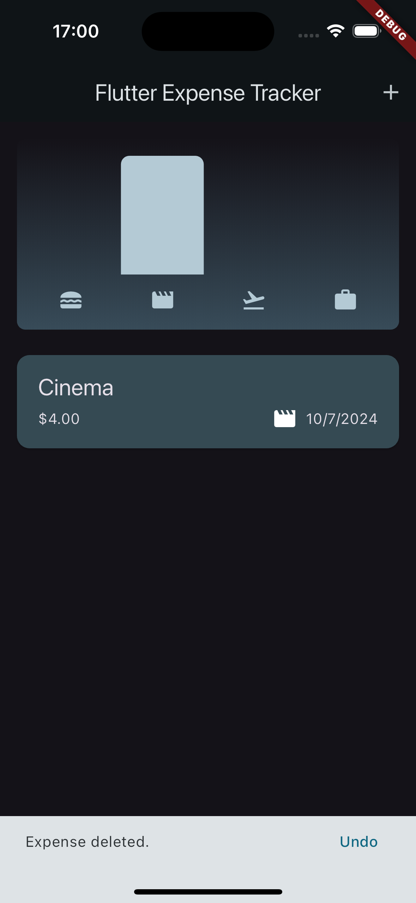

# Expenses App

This project is an expenses management application that helps users track their spending. It allows users to add and delete expense entries, as well as view a summary of their expenses.

## Features

- Add new expense entries
- Delete entries
- View a summary of expenses

## Screenshots

Below are some screenshots of the application:

### Dashboard






## Installation

To install and run the project locally, follow these steps:

1. Clone the repository:
    ```bash
    git clone https://github.com/efe-atas/LimakTechnology.git
    ```
2. Navigate to the project directory:
    ```bash
    cd LimakTechnology/Expenses/expenses_app
    ```
3. Install dependencies:
    ```bash
    npm install
    ```
4. Run the application:
    ```bash
    npm start
    ```

## Usage

Once the application is running, you can start managing your expenses. Use the "Add Expense" button to add a new entry, and click on any existing entry to edit or delete it. The dashboard provides a summary of your total expenses.

## License

This project is licensed under the MIT License.