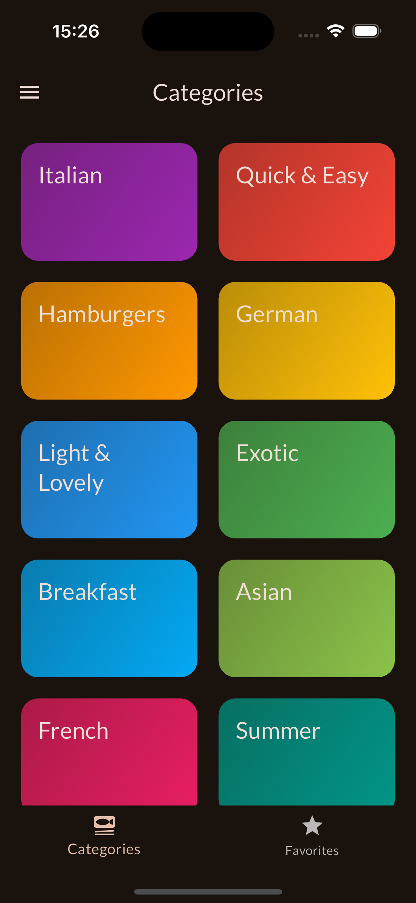
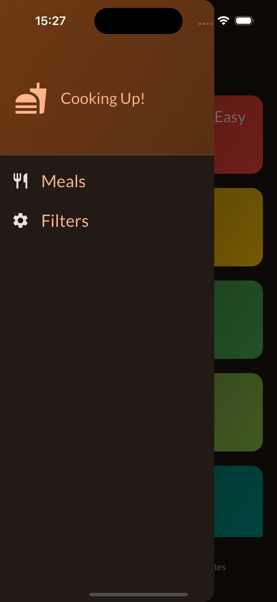
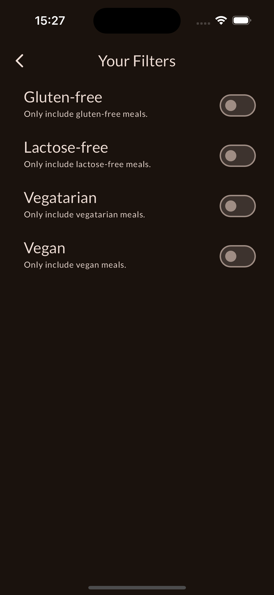
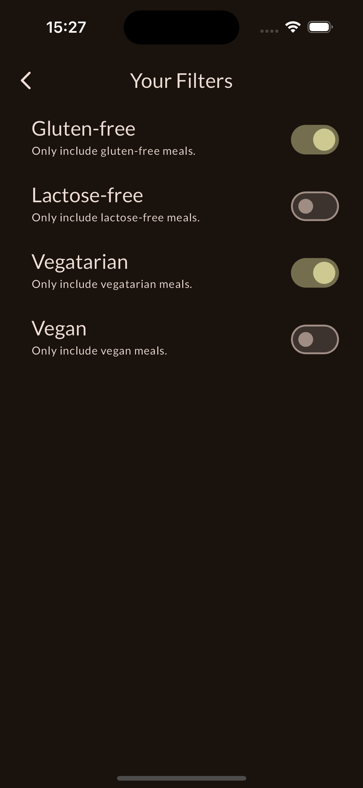
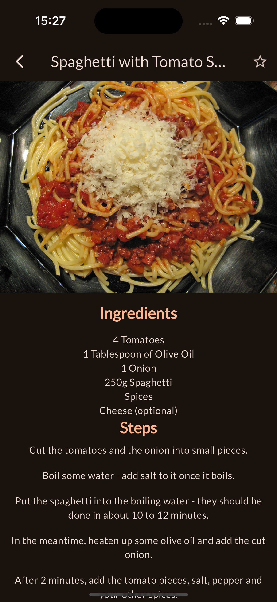

# Meals App

The Meals App is a simple application that allows users to browse and search for meal recipes. It provides details about various meals, including ingredients, preparation instructions, and nutritional information.

## Features

- Browse a list of meals
- View detailed information about each meal
- User-friendly interface

## Getting Started

### Prerequisites

To run this project, you need to have Flutter installed on your machine. If you don't have Flutter installed, follow the instructions on the [Flutter website](https://flutter.dev/docs/get-started/install) to set it up.

### Installation

1. Clone the repository:

```bash
git clone https://github.com/efe-atas/LimakTechnology.git
cd LimakTechnology/meals
```

2. Install the dependencies:

```bash
flutter pub get
```

3. Run the app:

```bash
flutter run
```

## Usage

Once the app is running, you can browse through the list of available meals. Click on any meal to view detailed information, including ingredients and preparation instructions.

## Screenshots

Here is a screenshot of the app in action:









## License

This project is licensed under the MIT License.

## Contact

If you have any questions or feedback, feel free to reach out:

- Email: efe.atas@icloud.com

