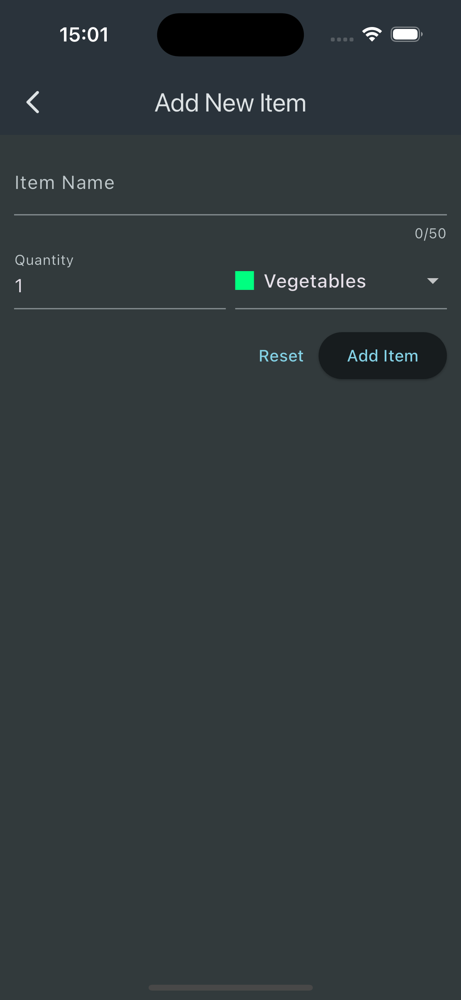

# Shopping List

This project is a shopping list application that allows users to add, edit, and delete items from their shopping list. It is designed to be simple and user-friendly.

## Features

- Add items to the shopping list
- Delete items from the list
- View the list of items

## Screenshots

Below are some screenshots of the application:

### Home Screen


### Add Item Screen




## Installation

To install and run the project locally, follow these steps:

1. Clone the repository:
    ```bash
    git clone https://github.com/efe-atas/LimakTechnology.git
    ```
2. Navigate to the project directory:
    ```bash
    cd LimakTechnology/shopping_list
    ```
3. Install dependencies:
    ```bash
    npm install
    ```
4. Run the application:
    ```bash
    npm start
    ```

## Usage

Once the application is running, you can start adding items to your shopping list. Use the "Add Item" button to add a new item, and slide on any existing item to edit or delete it.

## License

This project is licensed under the MIT License.
