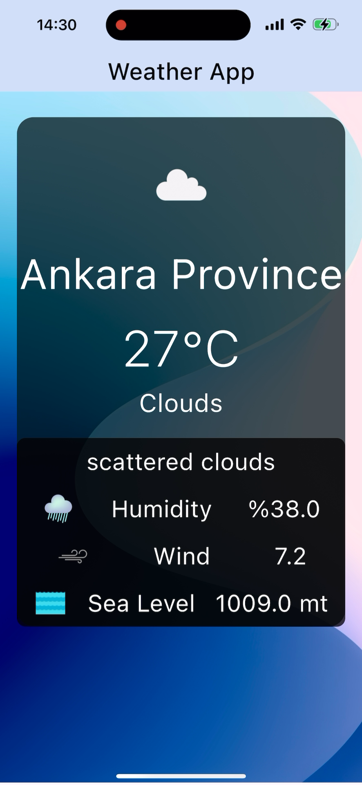

# Weather App

A new Flutter project focused on displaying weather information.

## Getting Started

This project is a starting point for a Flutter application that showcases weather information for various locations.

### Prerequisites

Before you begin, ensure you have met the following requirements:

- You have installed the latest version of Flutter.
- You have a working internet connection to fetch weather data.

### Installation

To install this project, follow these steps:

1. Clone the repository:
	```sh
	git clone https://github.com/your-username/weather_app.git
	```
2. Navigate to the project directory:
	```sh
	cd weather_app
	```
3. Install the dependencies:
	```sh
	flutter pub get
	```

### Usage

Once the app is running, you can browse through the weather information for different locations. Enter a city name to view detailed weather information, including temperature, humidity, and weather conditions.

### Screenshots

Here is a screenshot of the app in action:


### Resources

A few resources to get you started if this is your first Flutter project:

- [Lab: Write your first Flutter app](https://docs.flutter.dev/get-started/codelab)

For help getting started with Flutter development, view the
[online documentation](https://docs.flutter.dev/), which offers tutorials,
samples, guidance on mobile development, and a full API reference.

### Contributing

If you want to contribute to this project, please follow these steps:

1. Fork the repository.
2. Create a new branch (`git checkout -b feature-branch`).
3. Make your changes and commit them (`git commit -m 'Add some feature'`).
4. Push to the branch (`git push origin feature-branch`).
5. Create a Pull Request.

### License

This project is licensed under the MIT License - see the LICENSE file for details.

```bash
git clone https://github.com/efe-atas/LimakTechnology.git
cd LimakTechnology/meals
```

2. Install the dependencies:

```bash
flutter pub get
```

3. Run the app:

```bash
flutter run
```


## Screenshots

Here is a screenshot of the app in action:




## License

This project is licensed under the MIT License.

## Contact

If you have any questions or feedback, feel free to reach out:

- Email: efe.atas@icloud.com

